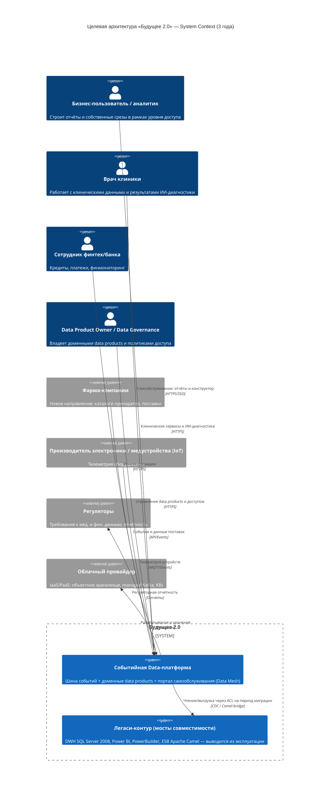
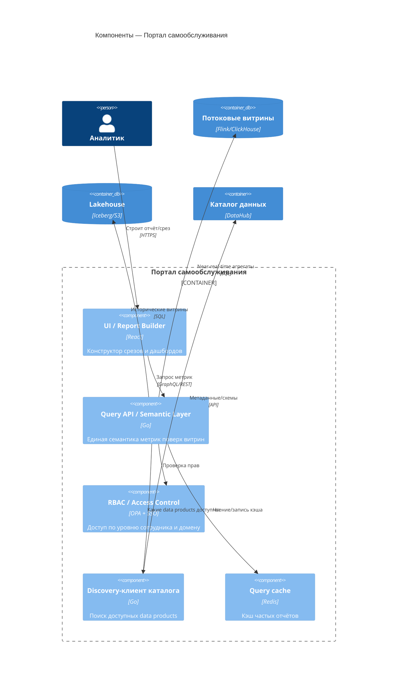
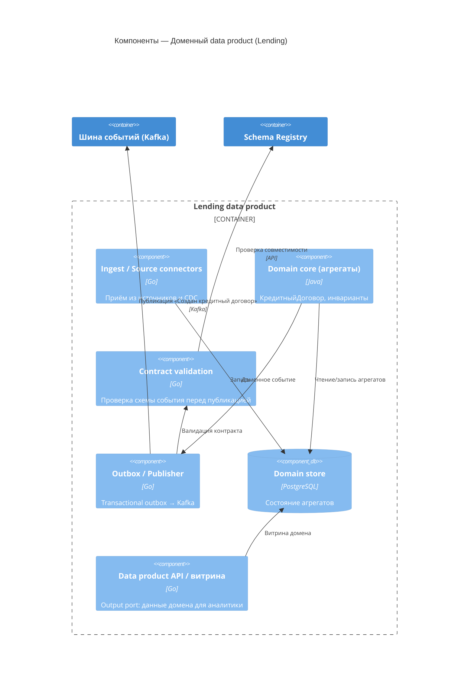

# Целевая архитектура «Будущее 2.0» (C4, горизонт 3 года)

Документ описывает целевую архитектуру в нотации **C4** на уровнях **Context → Container →
Component**. Целевое состояние — слабосвязанная **событийная платформа** с **Data Mesh** и
порталом самообслуживания. Легаси (DWH на SQL Server 2008, PowerBuilder, ESB Apache Camel)
сохраняется только как **«мосты совместимости»** на время миграции и закрывается
антикоррупционными слоями (ACL).

Ключевые принципы целевого состояния:
- **Домены владеют своими данными** и публикуют их как data products (Data Mesh).
- **Интеграция через события** (Kafka) вместо точечных синхронных вызовов и общих таблиц DWH.
- **Контракты данных** версионируются в Schema Registry; нарушения уходят в **DLQ**.
- **Портал самообslуживания** (Self-service BI) даёт отчётность «по любым срезам в рамках
  уровня доступа» и конструктор отчётов.
- **Мед.карты, истории болезней и результаты исследований не попадают в витрину** — по условию
  бизнеса они не используются для аналитики (остаются только в клиническом домене под отдельным
  контуром безопасности).

---

## Уровень 1 — System Context

**Что меняется при масштабировании.** Новые направления (фарма, электроника) и новые регионы
подключаются как **новые домены/data products** к шине событий — без врезки бизнес-логики в DWH.
Рост источников и событий поглощается горизонтальным масштабированием Kafka и доменных команд.
Переход от **batch к near-real-time** обеспечивается потоковой обработкой и потоковыми витринами.

---

## Уровень 2 — Containers

```mermaid
C4Container
    title Целевая архитектура «Будущее 2.0» — Containers

    Person(analyst, "Аналитик / бизнес-пользователь", "Отчёты, конструктор срезов")
    Person(dpo, "Data Product Owner", "Владеет доменным data product")

    System_Boundary(f20, "Будущее 2.0 — Data-платформа") {

        Container(portal, "Портал самообслуживания (Self-service BI)", "React + BI-движок (Superset/Metabase)", "Каталог отчётов, конструктор срезов, RBAC по уровню доступа")
        Container(catalog, "Каталог данных и контрактов", "DataHub/OpenMetadata", "Реестр data products, схемы, lineage, владельцы, политики доступа")

        Container(bus, "Шина событий", "Apache Kafka", "Доменные топики событий, партиционирование, ретеншн")
        Container(schema, "Schema Registry", "Confluent/Apicurio", "Версионируемые контракты событий, совместимость")
        Container(dlq, "DLQ + обработка ошибок", "Kafka topics + сервис", "Невалидные/непроцессируемые события")

        Container_Boundary(dom, "Доменные data products") {
            Container(dp_clinical, "Patient Care data product", "Python/Go", "Поток пациентов (без мед.карт в витрине)")
            Container(dp_ai, "Diagnostics AI data product", "Python", "ИИ-исследования: события результатов")
            Container(dp_lending, "Lending data product", "Java/Go", "Кредитные договоры")
            Container(dp_payments, "Payments data product", "Go", "Платежи, счета, биллинг")
            Container(dp_customer, "Customer 360 data product", "Go", "Единый клиент")
            Container(dp_finance, "Finance/Reporting data product", "Java", "Финотчётность")
        }

        ContainerDb(lake, "Lakehouse / объектное хранилище", "S3-совместимое + ClickHouse/Iceberg", "Сырые и витринные данные доменов")
        Container(stream, "Потоковые витрины", "Kafka Streams / Flink + dbt", "Near-real-time агрегаты для портала")

        Container(acl, "ACL / Legacy Bridge", "Camel-bridge + Debezium CDC", "Антикоррупционный слой к DWH/Camel")
    }

    System_Ext(dwh, "DWH SQL Server 2008 (legacy)", "Выводится из эксплуатации")
    System_Ext(camel, "ESB Apache Camel (legacy)", "Мост совместимости")
    System_Ext(cloud, "Облачный провайдер", "IaaS/PaaS")

    Rel(analyst, portal, "Запрашивает отчёты/срезы", "HTTPS/SSO")
    Rel(portal, catalog, "Обнаружение data products и схем", "API")
    Rel(portal, stream, "Чтение near-real-time витрин", "SQL/API")
    Rel(portal, lake, "Чтение исторических витрин", "SQL")

    Rel(dpo, catalog, "Регистрация и политики data product", "API")

    Rel(dp_clinical, bus, "Публикует события", "Kafka")
    Rel(dp_ai, bus, "Публикует «Пройдено исследование ИИ»", "Kafka")
    Rel(dp_lending, bus, "Публикует «Создан кредитный договор»", "Kafka")
    Rel(dp_payments, bus, "Публикует «Платёж проведён»", "Kafka")
    Rel(dp_customer, bus, "Публикует/подписывается", "Kafka")
    Rel(dp_finance, bus, "Подписывается на фин-события", "Kafka")

    Rel(bus, schema, "Валидация контрактов", "API")
    Rel(bus, dlq, "Невалидные события", "Kafka")
    Rel(bus, stream, "Потоковая обработка", "Kafka")
    Rel(stream, lake, "Материализация витрин", "Write")

    Rel(acl, dwh, "CDC-выгрузка на период миграции", "Debezium")
    Rel(acl, camel, "Адаптация старых интеграций", "Camel")
    Rel(acl, bus, "Публикует события из легаси", "Kafka")

    Rel(stream, cloud, "Развёрнуто в облаке", "K8s")

    UpdateLayoutConfig($c4ShapeInRow="3", $c4BoundaryInRow="1")
```

**Изоляция доменов.** Каждый data product — отдельный deploy-юнит со своей БД/хранилищем,
своими топиками и контрактами. Домены **не делят общую схему** (в отличие от DWH) и
взаимодействуют только через опубликованные события и витрины.

**Безопасность мед/фин-данных.** Клинический домен держит мед.карты/исследования в отдельном
защищённом контуре; в шину и витрину уходят только **обезличенные/разрешённые** события
(факт регистрации пациента, факт прохождения ИИ-исследования), но **не содержимое мед.карт**.

---

## Уровень 3 — Components

### 3.1. Портал самообслуживания (Self-service BI)

### 3.2. Типовой доменный data product (на примере Lending)

**Паттерны на уровне компонентов:** Transactional Outbox (гарантия доставки событий),
Contract-first (валидация по Schema Registry), Output Port (data product как продукт с SLA),
CDC через Debezium для подтягивания данных из легаси.

---

## Отказ от легаси (целевое состояние через 3 года)

| Легаси-система | Судьба | Замена |
|---|---|---|
| DWH SQL Server 2008 | Вывод из эксплуатации | Доменные data products + Lakehouse |
| PowerBuilder UI | Замена | Портал самообслуживания + доменные UI |
| Power BI (кастомизации) | Сокращение / замена | Self-service BI (Superset/Metabase) + семантический слой |
| ESB Apache Camel | Контейнируется ACL, затем вывод | Kafka + контракты событий |
| Точечные синхронные интеграции | Удаляются с критического пути | Событийная интеграция |

На горизонте 18–36 месяцев Camel и DWH остаются только как мосты для ещё не
мигрированных доменов и закрываются ACL; новые источники к ним **не подключаются**.
