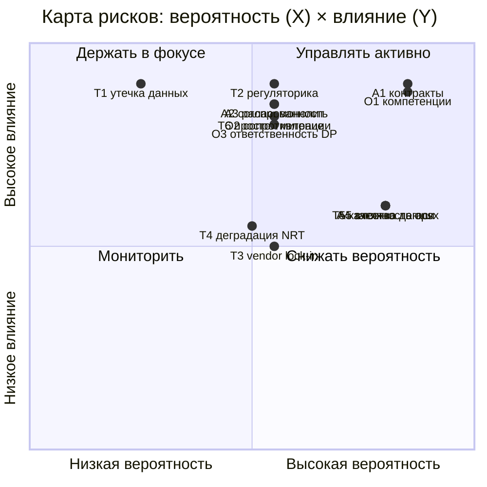

# Карта рисков трансформации «Будущее 2.0»

Риски сгруппированы по категориям: **архитектурные**, **организационные**, **технологические**.
Для каждого указаны **вероятность** (низкая / средняя / высокая) и **влияние на бизнес**
(низкое / среднее / высокое). План снижения — в [`risk-management-plan.md`](./risk-management-plan.md).

Шкала приоритета (P×I): 🔴 критический · 🟠 высокий · 🟡 средний · 🟢 низкий.

## Архитектурные риски

| ID | Риск | Вероятность | Влияние | Приоритет |
|----|------|:-----------:|:-------:|:---------:|
| A1 | Рассинхрон контрактов событий между доменами (breaking changes ломают подписчиков) | Высокая | Высокое | 🔴 |
| A2 | Распределённая согласованность: дубли/потеря событий, нарушение порядка | Средняя | Высокое | 🟠 |
| A3 | «Распределённый монолит»: домены остаются жёстко связанными через синхронные вызовы | Средняя | Высокое | 🟠 |
| A4 | Затягивание вывода DWH/Camel — мосты совместимости становятся постоянными | Высокая | Среднее | 🟠 |
| A5 | Рост сложности эксплуатации (Kafka, потоковые витрины, много сервисов) | Высокая | Среднее | 🟠 |
| A6 | Дублирование данных в Lakehouse и доменах → расхождение цифр в отчётах | Средняя | Среднее | 🟡 |

## Организационные риски

| ID | Риск | Вероятность | Влияние | Приоритет |
|----|------|:-----------:|:-------:|:---------:|
| O1 | Нехватка компетенций Data Mesh / Kafka / потоковой обработки | Высокая | Высокое | 🔴 |
| O2 | Сопротивление команд и владельцев легаси (PowerBuilder/DWH) изменениям | Средняя | Высокое | 🟠 |
| O3 | Размытая ответственность за data products (нет Data Product Owner) | Средняя | Высокое | 🟠 |
| O4 | Зависимость от ключевых носителей знаний о легаси (bus factor) | Средняя | Среднее | 🟡 |
| O5 | Несогласованность бизнес-целей доменов и платформенной команды | Средняя | Среднее | 🟡 |

## Технологические риски

| ID | Риск | Вероятность | Влияние | Приоритет |
|----|------|:-----------:|:-------:|:---------:|
| T1 | Утечка/компрометация мед. и фин. данных при миграции в облако | Низкая | Высокое | 🟠 |
| T2 | Нарушение требований регуляторов (мед/фин, локализация по регионам) | Средняя | Высокое | 🔴 |
| T3 | Vendor lock-in облачного провайдера | Средняя | Среднее | 🟡 |
| T4 | Деградация производительности near-real-time при росте объёма событий | Средняя | Среднее | 🟡 |
| T5 | Качество данных из легаси при CDC-миграции (грязные данные DWH 2008) | Высокая | Среднее | 🟠 |
| T6 | Простой/недоступность сервисов при переключении с легаси | Средняя | Высокое | 🟠 |

## Тепловая карта (вероятность × влияние)

**Критические риски (🔴), требующие первоочередного внимания:** A1 (контракты событий),
O1 (компетенции), T2 (регуляторика). Их меры снижения встроены уже в пилот (этап 1).
