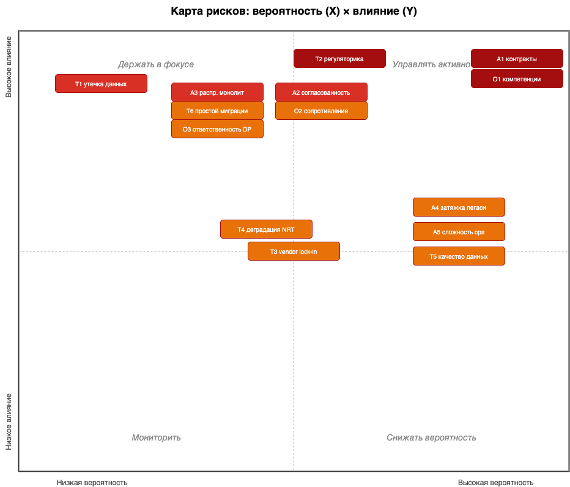
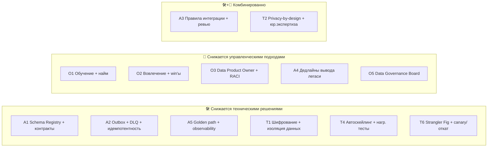

# Карта рисков трансформации «Будущее 2.0»

Риски сгруппированы по категориям: **архитектурные**, **организационные**, **технологические**.
Для каждого указаны **вероятность** (низкая / средняя / высокая) и **влияние на бизнес**
(низкое / среднее / высокое). План снижения — в [`risk-management-plan.md`](./risk-management-plan.md).

Шкала приоритета (P×I): 🔴 критический · 🟠 высокий · 🟡 средний · 🟢 низкий.

## Архитектурные риски

| ID | Риск | Вероятность | Влияние | Приоритет |
|----|------|:-----------:|:-------:|:---------:|
| A1 | Рассинхрон контрактов событий между доменами (breaking changes ломают подписчиков) | Высокая | Высокое | 🔴 |
| A2 | Распределённая согласованность: дубли/потеря событий, нарушение порядка | Средняя | Высокое | 🟠 |
| A3 | «Распределённый монолит»: домены остаются жёстко связанными через синхронные вызовы | Средняя | Высокое | 🟠 |
| A4 | Затягивание вывода DWH/Camel — мосты совместимости становятся постоянными | Высокая | Среднее | 🟠 |
| A5 | Рост сложности эксплуатации (Kafka, потоковые витрины, много сервисов) | Высокая | Среднее | 🟠 |
| A6 | Дублирование данных в Lakehouse и доменах → расхождение цифр в отчётах | Средняя | Среднее | 🟡 |

## Организационные риски

| ID | Риск | Вероятность | Влияние | Приоритет |
|----|------|:-----------:|:-------:|:---------:|
| O1 | Нехватка компетенций Data Mesh / Kafka / потоковой обработки | Высокая | Высокое | 🔴 |
| O2 | Сопротивление команд и владельцев легаси (PowerBuilder/DWH) изменениям | Средняя | Высокое | 🟠 |
| O3 | Размытая ответственность за data products (нет Data Product Owner) | Средняя | Высокое | 🟠 |
| O4 | Зависимость от ключевых носителей знаний о легаси (bus factor) | Средняя | Среднее | 🟡 |
| O5 | Несогласованность бизнес-целей доменов и платформенной команды | Средняя | Среднее | 🟡 |

## Технологические риски

| ID | Риск | Вероятность | Влияние | Приоритет |
|----|------|:-----------:|:-------:|:---------:|
| T1 | Утечка/компрометация мед. и фин. данных при миграции в облако | Низкая | Высокое | 🟠 |
| T2 | Нарушение требований регуляторов (мед/фин, локализация по регионам) | Средняя | Высокое | 🔴 |
| T3 | Vendor lock-in облачного провайдера | Средняя | Среднее | 🟡 |
| T4 | Деградация производительности near-real-time при росте объёма событий | Средняя | Среднее | 🟡 |
| T5 | Качество данных из легаси при CDC-миграции (грязные данные DWH 2008) | Высокая | Среднее | 🟠 |
| T6 | Простой/недоступность сервисов при переключении с легаси | Средняя | Высокое | 🟠 |

## Тепловая карта (вероятность × влияние)

**Критические риски (🔴), требующие первоочередного внимания:** A1 (контракты событий),
O1 (компетенции), T2 (регуляторика). Их меры снижения встроены уже в пилот (этап 1).

# План управления рисками

Для каждого риска представлены конкретные меры снижения с пометкой
типа: **🛠 техническое решение** или **👥 управленческий подход** (часть рисков закрывается
комбинацией). Указана привязка к этапам трансформации:
**Э1** (0–6 мес, пилот) · **Э2** (6–18 мес, критичные домены) · **Э3** (18–36 мес, потоковая аналитика).

## Архитектурные риски

| ID | Меры снижения | Тип | Этап |
|----|---------------|:---:|:----:|
| A1 | Schema Registry с проверкой совместимости (backward/forward); контрактные тесты в CI; политика версионирования событий; запрет breaking changes без депрекейшн-периода | 🛠 | Э1 |
| A2 | Transactional Outbox + идемпотентные потребители; ключи партиционирования для упорядочивания; exactly-once семантика где критично; DLQ + повторы | 🛠 | Э1–Э2 |
| A3 | Архитектурные правила: интеграция доменов только через события/витрины; запрет синхронных вызовов на критическом пути; fitness-функции в CI; ревью архитектора | 🛠 + 👥 | Э2–Э3 |
| A4 | План вывода легаси с дедлайнами и владельцами; ACL как **временный** слой с метрикой «доля трафика через мост»; квартальный пересмотр | 👥 | Э2–Э3 |
| A5 | Платформенная команда и golden path (шаблоны сервисов, IaC из Task1/Task2); единый observability-стек (логи/метрики/трейсы); managed-сервисы облака | 🛠 + 👥 | Э1–Э2 |
| A6 | Единый семантический слой метрик в портале; data lineage в каталоге; data quality-тесты (Great Expectations) | 🛠 | Э2 |

## Организационные риски

| ID | Меры снижения | Тип | Этап |
|----|---------------|:---:|:----:|
| O1 | Программа обучения Data Mesh/Kafka; найм/менторинг; платформенная команда как enabler; внешняя экспертиза на старте | 👥 | Э1 |
| O2 | Вовлечение владельцев легаси в дизайн ACL; быстрые win'ы на пилоте; коммуникация выгод; KPI по миграции | 👥 | Э1–Э2 |
| O3 | Назначить **Data Product Owner** на каждый домен; зафиксировать ответственность, SLA и контракты data product; RACI-матрица | 👥 | Э1 |
| O4 | Документирование легаси при CDC-миграции; парное сопровождение; knowledge base; снижение bus factor | 👥 | Э2 |
| O5 | Data Governance Board; привязка roadmap'а доменов к бизнес-целям; регулярная синхронизация платформы и доменов | 👥 | Э1–Э3 |

## Технологические риски

| ID | Меры снижения | Тип | Этап |
|----|---------------|:---:|:----:|
| T1 | Шифрование at-rest/in-transit; KMS; сетевая сегментация; мед.карты/исследования **не** выходят в витрину; PII-маскирование; аудит доступа | 🛠 | Э1 |
| T2 | Privacy-by-design; классификация данных в каталоге; политики доступа (OPA); геораспределённое размещение под локальные требования; юридическая экспертиза по регионам | 🛠 + 👥 | Э1–Э3 |
| T3 | Абстракция через Terraform-модули (см. Task1/Task2) и S3-совместимые/открытые стандарты (Kafka, Iceberg); избегать проприетарных PaaS на критическом пути | 🛠 | Э1–Э2 |
| T4 | Нагрузочное тестирование; автоскейлинг Kafka/Flink; партиционирование и ретеншн-политики; мониторинг lag'а потребителей | 🛠 | Э2–Э3 |
| T5 | Data quality-гейты на ingress; профилирование данных DWH; карантин/DLQ для грязных записей; ручная сверка на пилоте | 🛠 | Э2 |
| T6 | Strangler Fig: параллельная работа легаси и нового; canary/blue-green (см. CI/CD Task2); резервное копирование и план отката; окна переключения | 🛠 + 👥 | Э2–Э3 |

## Сводка: технические vs управленческие меры

**Принцип приоритизации:** критические риски (A1, O1, T2) закрываются мерами уже на **этапе 1
(пилот)** — единые принципы работы с событиями, каталог схем и DLQ вводятся с самого начала,
чтобы не масштабировать архитектурный долг на критичные домены.
