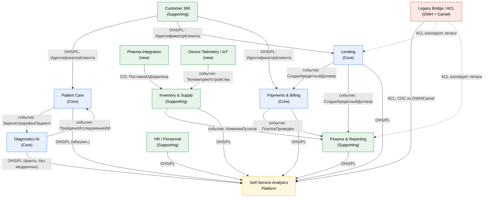

# Bounded Contexts «Будущее 2.0» (DDD)

Декомпозиция системы на домены и **bounded contexts** по принципам Domain-Driven Design.
Контексты сгруппированы по поддоменам: **Core** (ключевая ценность бизнеса), **Supporting**
(поддерживающие), **Generic** (типовые), плюс **платформенные/legacy**.

## Классификация доменов

| Домен / Bounded Context | Тип поддомена | Ответственность |
|---|---|---|
| **Patient Care** (Клинический поток) | Core | Регистрация пациентов, приёмы, маршрут пациента. Мед.карты/исследования — в защищённом контуре, **не в витрину** |
| **Diagnostics AI** (ИИ-диагностика) | Core | ИИ-исследования медданных, публикация фактов результатов |
| **Lending** (Кредиты) | Core | Кредитные договоры, скоринг, погашение |
| **Payments & Billing** (Платежи) | Core | Платежи, счета, биллинг услуг |
| **Customer 360** (Клиент) | Supporting | Единый профиль клиента/пациента, идентичность, согласия |
| **Finance & Reporting** (Финансы) | Supporting | Финотчётность, сверки, регуляторная отчётность |
| **HR / Personnel** (Персонал) | Supporting | Данные персонала больницы |
| **Inventory & Supply** (Склад/Снабжение) | Supporting | Инвентаризация, снабжение, оборудование |
| **Pharma Integration** (Фарма) | Supporting (новый) | Каталоги препаратов, поставки от фарм-компаний |
| **Device Telemetry / IoT** (Электроника) | Supporting (новый) | Телеметрия медоборудования |
| **Self-Service Analytics Platform** | Platform | Портал самообслуживания, витрины, каталог data products |
| **Legacy Bridge / ACL** | Platform/Legacy | Антикоррупционный слой к DWH и Camel на период миграции |

## Context Map

Типы связей: **OHS/PL** — Open Host Service / Published Language (стабильный контракт событий);
**ACL** — Anti-Corruption Layer; **C/S** — Customer/Supplier; **CF** — Conformist.

## Описание контекстов и границ

- **Patient Care.** Корневые понятия: `Пациент`, `Приём`, `МаршрутПациента`. Мед.карты и
  результаты исследований хранятся здесь под усиленной защитой и **не публикуются** в витрину —
  наружу выходит только факт регистрации/визита. Связь с Diagnostics AI — через события.
- **Diagnostics AI.** Принимает заявки на исследование, запускает ИИ-модели, публикует
  `ПройденоИсследованиеИИ` (факт + статус, без содержимого медданных в общей шине).
- **Lending.** Агрегат `КредитныйДоговор`; источник события `СозданКредитныйДоговор`.
  Изолирован от легаси через ACL на период миграции.
- **Payments & Billing.** Агрегаты `Платёж`, `Счёт`; источник `ПлатёжПроведён`, `СчётВыставлен`.
- **Customer 360.** Поставщик единого `ИдентификаторКлиента` (Published Language) для остальных
  доменов; хранит согласия на обработку данных.
- **Finance & Reporting.** Подписчик финансовых событий; формирует регуляторную отчётность.
- **Self-Service Analytics Platform.** Не доменный, а платформенный контекст: агрегирует
  опубликованные витрины/события в портал самообслуживания.
- **Legacy Bridge / ACL.** Транслирует данные из DWH (через CDC/Debezium) и Camel в события
  целевой платформы, защищая новые домены от модели легаси. Временный по замыслу.

## Стратегические паттерны взаимодействия

| Между контекстами | Паттерн | Обоснование |
|---|---|---|
| Customer 360 → Core-домены | OHS + Published Language | Единый стабильный контракт идентичности |
| Domain → Self-Service Analytics | OHS (события/витрины) | Домен публикует data product как продукт |
| Любой домен → Legacy (DWH/Camel) | ACL | Защита от устаревшей модели данных |
| Pharma/IoT → Inventory | Customer/Supplier | Новые поставщики данных встраиваются как апстрим |
