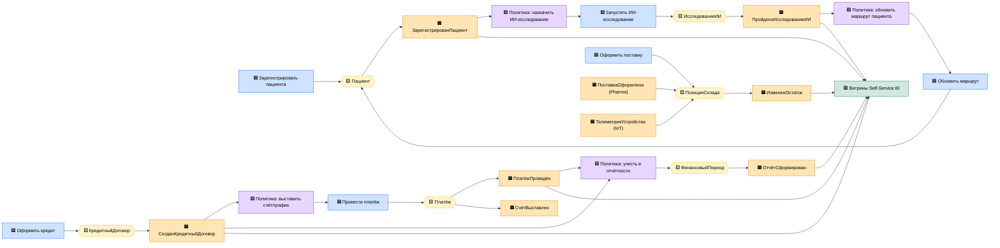

# Event Storming «Будущее 2.0»

Целевая событийная архитектура в нотации Event Storming. Условные обозначения:

- 🟦 **Команда** (Command) — намерение пользователя/системы
- 🟧 **Доменное событие** (Domain Event) — факт, опубликованный в шину
- 🟨 **Агрегат** (Aggregate) — где принимается решение и поддерживаются инварианты
- 🟪 **Политика/реакция** (Policy) — «когда произошло событие X → выполнить команду Y»
- 🟩 **Read Model / витрина** — проекция для портала самообслуживания

Полный каталог событий с контрактами — в [`events.md`](./events.md), агрегаты —
в [`aggregates.md`](./aggregates.md).

## Сквозной поток (big picture)

## Матрица «событие → источник → подписчики»

| Событие | Источник (Publisher) | Подписчики (Subscribers) |
|---|---|---|
| ЗарегистрированПациент | Patient Care | Diagnostics AI, Self-Service Analytics |
| ПройденоИсследованиеИИ | Diagnostics AI | Patient Care, Self-Service Analytics |
| СозданКредитныйДоговор | Lending | Payments & Billing, Finance, Self-Service Analytics |
| ПлатёжПроведён | Payments & Billing | Finance, Lending, Self-Service Analytics |
| СчётВыставлен | Payments & Billing | Finance, Customer 360 |
| ОтчётСформирован | Finance & Reporting | Self-Service Analytics, Регуляторная отчётность |
| ИзмененОстаток | Inventory & Supply | Finance, Self-Service Analytics |
| ПоставкаОформлена | Pharma Integration | Inventory & Supply |
| ТелеметрияУстройства | Device Telemetry / IoT | Inventory & Supply, Self-Service Analytics |
| КлиентОбновлён | Customer 360 | Все Core-домены |

## Замечания по моделированию

- **Развязка через политики.** Реакции между доменами оформлены как политики
  («когда `ЗарегистрированПациент` → запустить ИИ-исследование»), а не синхронные вызовы —
  это и есть переход от шины Camel/DWH к слабосвязанной событийной модели.
- **Изоляция медданных.** В шину публикуются только факты (регистрация, прохождение
  исследования), без содержимого мед.карт — соответствует ограничению витрины.
- **Read models** питают портал самообслуживания near-real-time, заменяя batch-отчёты DWH.
