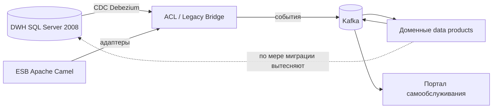

# Обоснование событийного подхода vs Camel + DWH

Почему «Будущему 2.0» нужно перейти от текущей интеграции через **ESB Apache Camel** и общий
**DWH (SQL Server 2008)** к **событийной архитектуре** (Kafka + контракты событий + Data Mesh).

## Проблемы текущего состояния

| Проблема сегодня | Причина | Следствие для бизнеса |
|---|---|---|
| Отчёты строятся часами | Сотни ТБ + множество трансформаций поверх единого DWH | Медленный time-to-market, падение производительности аналитики |
| Бизнес-логика «зашита» в DWH | Логика доменов в общей БД и в Camel-маршрутах | Любое новое направление требует правок в DWH |
| Жёсткая связанность | Точечные синхронные интеграции через шину | Изменение в одном домене ломает другие |
| Тяжело подключать новые домены | Нет доменных границ, всё через центральный DWH | Фарма/электроника/новые регионы внедряются долго |
| Batch-отчётность | DWH-ориентированный пайплайн | Нет near-real-time реакции |
| Легаси-риски | SQL Server 2008, PowerBuilder | Дорогая поддержка, дефицит экспертизы |

## Что даёт событийный подход

### 1. Гибкость (развязка доменов)
Домены публикуют **факты** (события) и подписываются на нужные, не зная друг о друге. Новое
направление (фарма, IoT-устройства, новый регион) подключается как **новый data product**,
который публикует/потребляет события — **без врезки бизнес-логики в DWH**. Это прямо закрывает
требование «интеграция новых бизнес-направлений без значительных объёмов логики в DWH».

### 2. Масштабируемость
Kafka масштабируется горизонтально (партиции, потребительские группы). Рост числа источников и
событий поглощается без переписывания центрального хранилища. Каждый домен масштабирует свой
data product независимо (Data Mesh), а не конкурирует за ресурсы общего DWH.

### 3. Скорость реакции (near-real-time)
События обрабатываются потоково (Kafka Streams/Flink) и материализуются в **потоковые витрины** —
портал самообслуживания показывает данные в near-real-time, а не «через часы batch'а». Это
реализует целевую долгосрочную цель «переход от batch к near-real-time».

### 4. Ослабление связности и устойчивость
Падение подписчика не блокирует издателя: события сохраняются в логе, потребитель догоняет
позже; ошибки уходят в **DLQ**. В синхронной модели Camel сбой одного звена каскадно ломает цепочку.

### 5. Эволюционируемость контрактов
**Schema Registry** даёт версионирование и контроль совместимости контрактов — домены развиваются
независимо без «больших согласований». В DWH изменение общей схемы затрагивает всех потребителей сразу.

### 6. Снижение стоимости владения
Уход от лицензий SQL Server 2008 и дорогой поддержки PowerBuilder/Camel к открытым стандартам
(Kafka, Iceberg, S3-совместимое хранилище) и облачным managed-сервисам (см. TCO в Task5).

## Сравнение «в лоб»

| Критерий | Camel + DWH (как есть) | Событийная платформа (целевая) |
|---|---|---|
| Связанность | Высокая (синхронные интеграции, общая схема) | Низкая (события, контракты) |
| Подключение нового домена | Правки в DWH/Camel | Новый data product, подписка на события |
| Время отчёта | Часы (batch) | Near-real-time (потоковые витрины) |
| Масштабирование | Вертикальное, общий DWH — узкое место | Горизонтальное (Kafka, независимые домены) |
| Владение данными | Централизованное (DWH-команда) | Доменное (Data Product Owner) |
| Устойчивость к сбоям | Каскадные сбои | Изоляция + DLQ + повторы |
| Эволюция контрактов | Общая схема, тяжёлые согласования | Schema Registry, версионирование |
| Стоимость | Лицензии + поддержка легаси | Открытые стандарты + managed cloud |

## Роль Camel и DWH в переходный период

Событийный подход **не требует одномоментного отказа** от легаси. Camel и DWH сохраняются как
**«мосты совместимости»**: антикоррупционный слой (ACL) с **CDC (Debezium)** вычитывает данные из
DWH и публикует их как события, а Camel-адаптеры транслируют старые интеграции в шину. Это
стратегия **Strangler Fig** — новое окружает и постепенно вытесняет старое:

К концу горизонта (18–36 мес) синхронные интеграции уходят с критического пути, новые источники
к DWH/Camel **не подключаются**, а сам легаси-контур выводится из эксплуатации.

## Вывод
Событийная архитектура с Data Mesh напрямую решает корневые проблемы «Будущего 2.0»: устраняет
DWH как узкое место отчётности, позволяет подключать новые направления без логики в DWH, даёт
near-real-time и снижает связанность и стоимость. Переход поэтапный и безопасный за счёт ACL и
Strangler Fig.
