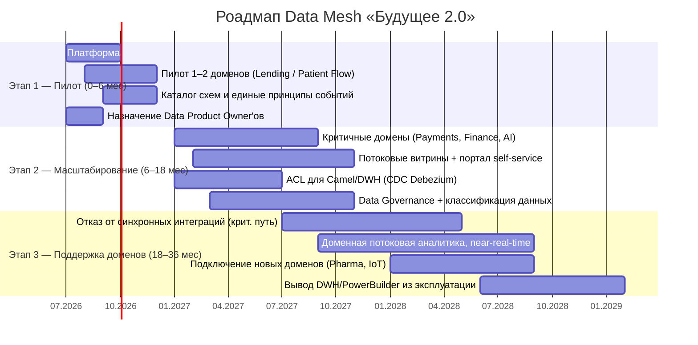

# Стратегический роадмап внедрения Data Mesh

Роадмап перехода «Будущего 2.0» к событийной платформе с Data Mesh: ключевые **роли**, **этапы**
(пилот → масштабирование → поддержка доменов) и привязка к **бизнес-целям**. Этапы согласованы с
тремя этапами трансформации из условия.

## Ключевые роли

| Роль | Зона ответственности |
|---|---|
| **Data Product Owner** | Владелец доменного data product: контракт, SLA, политики доступа, бэклог данных домена |
| **Data Engineer** | Пайплайны, потоковые витрины, dbt-модели, качество данных, CDC из легаси |
| **BI-аналитик** | Отчёты и срезы в портале самообслуживания, семантический слой, обучение бизнес-пользователей |
| **Platform Team** | Платформа как продукт: Kafka, Schema Registry, каталог, golden path, IaC, observability |
| **Data Governance / Steward** | Классификация данных, доступы, регуляторика (мед/фин), приватность |
| **Архитектор данных** | Доменные границы, контракты событий, fitness-функции, контроль связности |

## Этапы внедрения

## Этапы и привязка к бизнес-целям

### Этап 1 — Пилот (0–6 мес)
- **Что:** развернуть платформу (Kafka, Schema Registry, DLQ), запустить пилот в 1–2 доменах
  (финансовые расчёты / пациентский поток), ввести единые принципы событий и каталог схем,
  назначить Data Product Owner'ов.
- **Роли в фокусе:** Platform Team, Data Product Owner, Архитектор данных.
- **Бизнес-цель:** *Промежуточное состояние* — архитектура согласована, границы доменов
  определены, запущены первые проекты витрины данных.

### Этап 2 — Масштабирование (6–18 мес)
- **Что:** распространить на критичные домены, запустить **потоковые витрины** и **портал
  самообслуживания**, ввести **ACL** для интеграций через Camel/DWH, поднять Data Governance.
- **Роли в фокусе:** Data Engineer, BI-аналитик, Data Governance.
- **Бизнес-цель:** *Финальное состояние (через год)* — реализован портал самообслуживания,
  бизнес-пользователи в доменах работают с данными в новой архитектуре (легаси допустимо
  временно сохранять в отдельных доменах).

### Этап 3 — Поддержка и развитие доменов (18–36 мес)
- **Что:** отказ от точечных синхронных интеграций на критическом пути, переход к доменной
  потоковой аналитике, подключение новых направлений (фарма, электроника/IoT) и регионов,
  вывод DWH/PowerBuilder из эксплуатации.
- **Роли в фокусе:** Data Product Owner (новые домены), Platform Team, Data Governance (регионы).
- **Бизнес-цель:** *Долгосрочная цель (3 года)* — масштабирование по продуктам (новые финтех/мед-
  сервисы, монетизация ИИ), географии (2–3 региона) и данным (рост источников, near-real-time);
  целевая слабосвязанная событийная платформа.

## Карта «этап → роли → результат → бизнес-цель»

| Этап | Ведущие роли | Ключевой результат | Бизнес-цель |
|---|---|---|---|
| 1. Пилот (0–6 мес) | Platform Team, DPO, Архитектор | Платформа + 1–2 пилотных data product | Промежуточное состояние |
| 2. Масштабирование (6–18 мес) | Data Engineer, BI-аналитик, Governance | Портал self-service + потоковые витрины + ACL | Финальное состояние (портал) |
| 3. Поддержка (18–36 мес) | DPO новых доменов, Platform, Governance | Потоковая аналитика, новые домены, вывод легаси | Долгосрочная цель (масштаб) |

## Критерии готовности перехода между этапами
- **Э1 → Э2:** пилотный домен публикует/потребляет события через контракты, DLQ работает,
  каталог схем заполнен, есть назначенные DPO.
- **Э2 → Э3:** критичные домены на потоковых витринах, портал self-service в проде, ACL
  закрывает легаси, Data Governance действует.
- **Завершение Э3:** синхронные интеграции убраны с критического пути, DWH/PowerBuilder выведены,
  новые домены подключаются как data products.
