# TCO-анализ: текущая vs целевая архитектура

Модель **Total Cost of Ownership** на горизонте 3 лет для текущей (легаси: DWH SQL Server 2008,
PowerBuilder, Camel, кастомный Power BI) и целевой (событийная платформа + Data Mesh + облако)
архитектур.

> ⚠️ **Допущения.** Цифры — иллюстративная модель порядка величин для обоснования решения, а не
> бюджетная смета. Валюта — **млн ₽/год**. Базис: ~150 аналитиков/пользователей отчётности,
> сотни ТБ данных, 4 действующих подразделения + 2 новых направления к 3-му году. Реальные
> значения уточняются в финмодели проекта.

## Статьи затрат

| Категория | Что входит |
|---|---|
| Инфраструктура | Серверы/облако, хранилище, сеть, Kafka/K8s |
| Лицензии | SQL Server, Power BI, проприетарный софт vs open-source |
| Сопровождение легаси | Поддержка DWH/PowerBuilder/Camel, патчи, специалисты |
| Время аналитиков | Стоимость часов на построение/ожидание отчётов |
| Миграция и обучение | Разовые затраты на трансформацию (только целевая) |

## Текущая архитектура (как есть)

| Статья | Год 1 | Год 2 | Год 3 | Σ 3 года |
|---|---:|---:|---:|---:|
| Инфраструктура (он-прем, старое железо) | 40 | 44 | 48 | 132 |
| Лицензии (SQL Server, Power BI) | 30 | 32 | 34 | 96 |
| Сопровождение легаси (DWH/PB/Camel) | 50 | 55 | 60 | 165 |
| Время аналитиков (медленные отчёты) | 60 | 66 | 73 | 199 |
| **Итого** | **180** | **197** | **215** | **592** |

> Затраты **растут** год к году: легаси дорожает в поддержке, объём данных и число сценариев
> увеличивают время аналитиков, новые направления усиливают нагрузку на единый DWH.

## Целевая архитектура (событийная + Data Mesh)

| Статья | Год 1 | Год 2 | Год 3 | Σ 3 года |
|---|---:|---:|---:|---:|
| Облачная инфраструктура (Kafka/K8s/Object Storage) | 45 | 50 | 52 | 147 |
| Лицензии (преим. open-source: Iceberg/ClickHouse/Superset) | 12 | 10 | 8 | 30 |
| Сопровождение (платформа + домены) | 40 | 38 | 35 | 113 |
| Время аналитиков (self-service, near-real-time) | 45 | 30 | 22 | 97 |
| Миграция и обучение (разово, убывает) | 60 | 35 | 10 | 105 |
| Остаточное сопровождение легаси (мосты, убывает) | 35 | 18 | 5 | 58 |
| **Итого** | **237** | **181** | **132** | **550** |

> Затраты **снижаются** год к году: лицензии замещаются open-source, время аналитиков падает
> за счёт self-service, легаси и миграционные затраты сходят на нет к 3-му году.

## Сравнение и точка окупаемости

| Год | Текущая | Целевая | Дельта (экономия) |
|---|---:|---:|---:|
| Год 1 | 180 | 237 | **−57** (инвестиция) |
| Год 2 | 197 | 181 | **+16** |
| Год 3 | 215 | 132 | **+83** |
| **Σ 3 года** | **592** | **550** | **+42** |

```mermaid
xychart-beta
    title "TCO: текущая vs целевая (млн ₽/год)"
    x-axis ["Год 1", "Год 2", "Год 3"]
    y-axis "млн ₽" 0 --> 260
    bar [180, 197, 215]
    bar [237, 181, 132]
```

*(Первый ряд — текущая, второй — целевая.)*

**Точка окупаемости — в течение 2-го года:** пик инвестиций приходится на год 1 (миграция +
параллельная работа легаси), далее целевая модель дешевле и расходится с легаси по нарастающей.
На горизонте >3 лет разрыв увеличивается (легаси продолжает дорожать, целевая — дешеветь).

## Качественные выгоды (вне прямого TCO)

- **Time-to-market** новых направлений: подключение домена за недели вместо месяцев правок в DWH.
- **Near-real-time** вместо часовых batch-отчётов → быстрее бизнес-решения.
- **Снижение регуляторных рисков** за счёт классификации/изоляции мед- и фин-данных.
- **Устранение legacy-рисков**: уход от SQL Server 2008 и дефицитной экспертизы PowerBuilder.
- **Монетизация ИИ-функций** и масштабирование на новые регионы становятся технически возможны.

## Вывод
На 3-летнем горизонте целевая архитектура уже **дешевле в сумме** (550 против 592) при существенно
более низких затратах к 3-му году (132 против 215) и кардинально лучших качественных показателях.
Год 1 — инвестиционный; окупаемость наступает в течение года 2.
