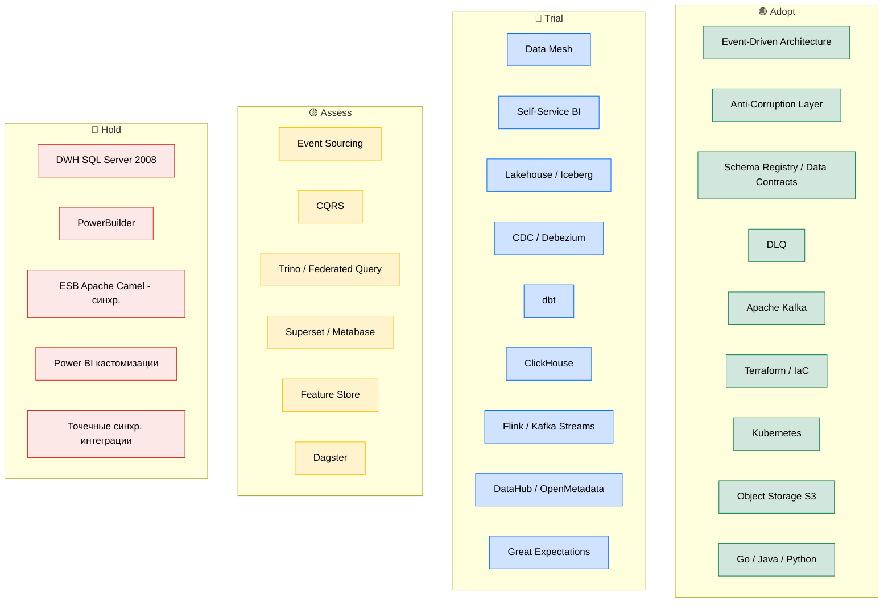

# Расширенный технологический радар «Будущее 2.0»

Радар включает **технологии** и **архитектурные паттерны**. Кольца:

- **Adopt** — применяем по умолчанию, проверено.
- **Trial** — внедряем в пилотах/ограниченно, набираем опыт.
- **Assess** — изучаем, делаем PoC, решение не принято.
- **Hold** — не начинать новое; выводить из эксплуатации.

Квадранты: **Паттерны и техники · Платформы · Инструменты · Языки и фреймворки**.

## Кольца радара (визуализация)

## Квадрант 1 — Паттерны и техники

| Блип | Кольцо | Обоснование |
|---|---|---|
| Event-Driven Architecture | **Adopt** | Базовый паттерн целевой платформы — развязка доменов |
| Anti-Corruption Layer | **Adopt** | Изоляция от легаси (DWH/Camel) на миграции |
| Data Contracts / Schema Registry | **Adopt** | Версионирование контрактов событий, совместимость |
| Dead Letter Queue (DLQ) | **Adopt** | Обработка ошибочных событий, требование этапа 1 |
| Data Mesh | **Trial** | Доменное владение данными; раскатываем по доменам поэтапно |
| Self-Service BI | **Trial** | Портал самообслуживания, конструктор отчётов |
| CDC (Change Data Capture) | **Trial** | Вытягивание данных из DWH без врезки в логику |
| Event Sourcing | **Assess** | Полезно точечно (аудит фин-операций), не повсеместно |
| CQRS | **Assess** | Для доменов с тяжёлым чтением (витрины) |

## Квадрант 2 — Платформы

| Блип | Кольцо | Обоснование |
|---|---|---|
| Apache Kafka | **Adopt** | Шина событий целевой архитектуры |
| Kubernetes | **Adopt** | Оркестрация доменных сервисов в облаке |
| Object Storage (S3-совместимое) | **Adopt** | Хранилище витрин/lakehouse (см. Task2 backend) |
| Lakehouse / Apache Iceberg | **Trial** | Открытый формат витрин, уход от проприетарного DWH |
| ClickHouse | **Trial** | Быстрые аналитические витрины для портала |
| Flink / Kafka Streams | **Trial** | Потоковая обработка → near-real-time |
| Trino (federated query) | **Assess** | Запросы поверх нескольких источников |
| DWH SQL Server 2008 | **Hold** | Узкое место отчётности; выводим из эксплуатации |

## Квадрант 3 — Инструменты

| Блип | Кольцо | Обоснование |
|---|---|---|
| Terraform / IaC | **Adopt** | Уже используется (Task1/Task2), основа провижининга |
| Debezium | **Trial** | CDC из легаси в шину |
| dbt | **Trial** | Трансформации витрин как код, тесты данных |
| DataHub / OpenMetadata | **Trial** | Каталог data products, lineage, governance |
| Great Expectations | **Trial** | Контроль качества данных на ingress |
| Superset / Metabase | **Assess** | Open-source BI как замена кастомного Power BI |
| Dagster | **Assess** | Оркестрация data-пайплайнов (альтернатива Airflow) |
| Power BI (кастомизации) | **Hold** | Дорогие кастомизации поверх DWH; сокращаем |

## Квадрант 4 — Языки и фреймворки

| Блип | Кольцо | Обоснование |
|---|---|---|
| Go | **Adopt** | Финтех-сервисы, высоконагруженные data products |
| Java | **Adopt** | Финтех/энтерпрайз-домены |
| Python | **Adopt** | ИИ-сервисы, data engineering |
| PowerBuilder | **Hold** | Легаси-UI; заменяется порталом и доменными UI |
| Apache Camel (синхронные маршруты) | **Hold** | Только как временный мост через ACL |

## Принцип ранжирования
**Adopt** — то, что составляет ядро целевой платформы и уже валидировано (события, контракты, IaC,
Kafka). **Trial** — ключевые элементы Data Mesh, которые раскатываем поэтапно по доменам.
**Assess** — точечные усиления (Event Sourcing/CQRS/federated query). **Hold** — весь легаси-стек,
который выводится из эксплуатации в горизонте 3 лет.
